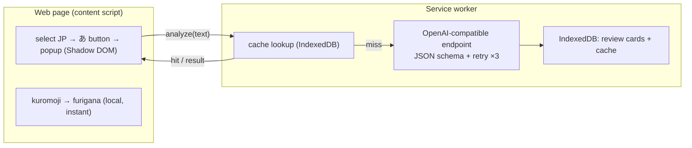

<p align="center">
  
</p>

# Japanisch-Lesehilfe

> Stärke dein Leseverständnis — markiere beliebiges Japanisch auf einer Webseite und erhalte sofort Furigana sowie eine auf Abruf verfügbare, JLPT-bewusste KI-Analyse (Übersetzung, Grammatik, Vokabular), und verwandle das Gelernte in wiederholbare Karten.

**Deutsch** · [English](README.md) · [Español](README.es.md) · [Français](README.fr.md) · [한국어](README.ko.md) · [Português](README.pt.md) · [Русский](README.ru.md) · [简体中文](README.zh-Hans.md) · [繁體中文](README.zh-Hant.md)

Eine Chrome-Erweiterung (Manifest V3) zum Lesen von Japanisch im Web. Furigana wird lokal und sofort erzeugt; die KI-Erklärung läuft nur auf Anfrage und passt ihre Tiefe an dein JLPT-Niveau an.

## Funktionen

- **Markieren zum Lernen** — markiere japanischen Text, und daneben erscheint eine kleine **あ**-Schaltfläche; ein Klick öffnet ein In-Page-Popup (gerendert in einem Shadow DOM, isoliert von der Host-Seite).
- **Sofortige lokale Furigana** — [kuromoji](https://github.com/takuyaa/kuromoji.js) (IPADIC) tokenisiert im Browser und rendert die Lesungen als HTML-ruby über den Kanji. Offline, kostenlos, ohne Tokens.
- **KI-Erklärung auf Abruf** — klicke auf **Explain with AI** für die Übersetzung, Grammatikpunkte und das Vokabular. Sie läuft nur auf Klick (keine automatischen Aufrufe), und die KI liefert außerdem korrigierte, kontextbewusste Furigana, die kuromojis Vermutung bei mehrdeutigen Kanji überschreibt (z. B. 「間」→ あいだ, nicht ま).
- **JLPT-bewusste Tiefe** — Anfänger erklärt jede Partikel und grundlegende Konjugation; N3 setzt N5–N4 als bekannt voraus und konzentriert sich auf Grammatik ab N3; N2/N1 behandelt nur fortgeschrittene/idiomatische Strukturen.
- **Strukturierte, zuverlässige Ausgabe** — das Modell wird durch ein JSON Schema eingeschränkt; nicht parsbare Ausgaben werden bis zu 3 Mal wiederholt.
- **Zwischenspeichern & Wiederverwenden** — Ergebnisse werden nach Inhalt zwischengespeichert (normalisierter Text + Niveau + Sprache), sodass das erneute Markieren desselben Satzes die gespeicherte Analyse sofort anzeigt; eine **Re-analyze**-Schaltfläche erzwingt eine Aktualisierung.
- **Wiederholungskarten** — jede Erklärung wird aufgezeichnet (automatisch oder über eine **Save**-Schaltfläche, wenn die automatische Aufzeichnung deaktiviert ist). Die Wiederholungsseite gruppiert die Karten nach JLPT-Niveau und filtert nach Niveau und Erklärungssprache.
- **9 Muttersprachen** — 简体中文 / 繁體中文 / English / 한국어 / Español / Français / Deutsch / Português / Русский. Deine Muttersprache ist sowohl die Erklärungssprache als auch die Sprache der Benutzeroberfläche (über [vue-i18n](https://vue-i18n.intlify.dev/)).
- **Bring dein eigenes Modell mit** — jeder OpenAI-kompatible Endpunkt, in der Cloud oder lokal. Anbieter-Voreinstellungen und ein Verbindungstest sind in den Einstellungen integriert.

## Installation

Noch kein Store-Eintrag — lade die gebaute Erweiterung entpackt:

```bash
pnpm install
pnpm build        # outputs to dist/
```

1. Öffne `chrome://extensions`
2. Aktiviere den **Entwicklermodus**
3. **Entpackt laden** → wähle den Ordner `dist/`

> Nach dem Neuladen der Erweiterung aktualisiere alle bereits geöffneten Seiten, damit das neue Content Script eingefügt wird.

## Verwendung

1. Klicke auf das Symbol in der Symbolleiste → lege deine **Muttersprache**, dein **JLPT-Niveau** und ein **Modell** fest (Base URL / Model / API Key). Lokale Endpunkte (localhost) benötigen in der Regel keinen Schlüssel. Verwende **Test connection** zum Prüfen. Die Einstellungen werden automatisch gespeichert.
2. Markiere auf einer beliebigen Seite **japanischen Text** → die **あ**-Schaltfläche erscheint → klicke sie an.
3. Das Popup zeigt den Text sofort mit **Furigana** an. Klicke auf **Explain with AI** für die Analyse.
4. Erklärungen werden zu Wiederholungskarten. Öffne **Review** aus dem Popup, um sie zu durchsuchen, zu filtern (Niveau / Sprache) und zu löschen.

## Modelle

Die Erweiterung kommuniziert mit jedem **OpenAI-kompatiblen** `/chat/completions`-Endpunkt — eine Konfiguration (`Base URL`, `Model`, `API Key`) deckt sowohl Cloud als auch lokal ab.

| | Example Base URL | API Key |
|---|---|---|
| **Cloud** | `https://api.openai.com/v1`, `https://api.deepseek.com/v1`, `https://dashscope.aliyuncs.com/compatible-mode/v1`, … | erforderlich |
| **Lokal** | `http://localhost:11434/v1` (Ollama), `http://localhost:1234/v1` (LM Studio) | in der Regel keiner |

Voreinstellungen für gängige Anbieter sind in den Einstellungen integriert; beide Felder sind editierbare Comboboxen, sodass du jeden beliebigen Wert eingeben kannst. Furigana nutzt **nicht** die KI — sie wird lokal von kuromoji erzeugt, funktioniert also offline und kostet nichts.

> **Hinweis für lokal (Ollama):** die Anfrage stammt vom Origin der Erweiterung. Wenn der Verbindungstest einen 403/CORS-Fehler zurückgibt, erlaube den Origin der Erweiterung — z. B. `launchctl setenv OLLAMA_ORIGINS "chrome-extension://*"` und starte anschließend Ollama neu.

## Datenschutz

- **Furigana** wird vollständig in deinem Browser berechnet (kuromoji) — nichts verlässt deinen Rechner.
- **KI-Analyse** sendet den markierten Text an den von dir konfigurierten Endpunkt. Ein Cloud-Endpunkt bedeutet, dass der Text an einen Dritten gesendet wird; ein lokaler Endpunkt behält ihn auf deinem Rechner.
- **Der Speicher ist lokal** — Einstellungen in `chrome.storage.local`; Wiederholungskarten und der Analyse-Cache in IndexedDB (Origin der Erweiterung). Nichts wird anderswohin hochgeladen.

## Architektur

Manifest V3, gebaut mit **Vue 3 + Vite + [CRXJS](https://crxjs.dev/) + Tailwind CSS + TypeScript**. Vier Oberflächen teilen sich eine gemeinsame `src/shared`-Schicht (Typen, Einstellungen, Speicher, KI-Client, JSON-Schema, kuromoji-Wrapper, i18n, Messaging):

- **content script** — erkennt japanische Markierungen, zeigt die schwebende **あ**-Schaltfläche an und mountet das Popup innerhalb eines Shadow DOM. Führt kuromoji lokal für Furigana aus.
- **service worker** — die einzige Stelle, die den KI-Endpunkt aufruft (der Origin der Erweiterung umgeht das CORS der Seite). Erzwingt das JSON-Schema, wiederholt Versuche, speichert Ergebnisse zwischen und schreibt Wiederholungskarten in IndexedDB.
- **popup** (Symbolleiste) — alle Einstellungen sowie eine Schaltfläche, die die Wiederholungsseite öffnet.
- **options page** — die Wiederholungsaufzeichnungen (nach JLPT-Niveau gruppiert, filterbar).



Der KI-Vertrag befindet sich in `src/shared/schema.ts` (JSON Schema + Parser) und `src/shared/prompt.ts` (niveaubewusster System-Prompt). Der Wechsel des Anbieters ist nur eine andere Base URL. Siehe [`docs/dev-memory/architecture.md`](docs/dev-memory/architecture.md) für die vollständigen Design-Notizen.

## Entwicklung

Erfordert **pnpm**.

```bash
pnpm install
pnpm dev          # Vite dev server with HMR (load dist/ as unpacked)
pnpm build        # production build → dist/
pnpm type-check   # vue-tsc
```

- **Furigana-Wörterbuch** — `scripts/copy-dict.mjs` kopiert das kuromoji-Wörterbuch aus `node_modules` nach `public/assets/dict/` vor dev/build (~19 MB, nicht eingecheckt).
- **Symbole** — bearbeite `icons/icon.svg` und führe dann `node scripts/generate-icons.mjs` aus, um die PNGs neu zu generieren (Chrome-Erweiterungssymbole müssen Raster sein).
