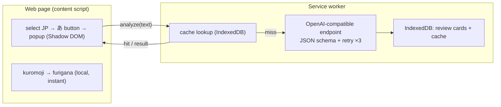

<p align="center">
  
</p>

# Asistente de lectura de japonés

> Refuerza tu comprensión lectora: selecciona cualquier texto en japonés de una página web para obtener furigana al instante, además de un análisis con IA bajo demanda y adaptado al nivel JLPT (traducción, gramática, vocabulario), y convierte lo que estudias en tarjetas repasables.

[Deutsch](README.de.md) · [English](README.md) · **Español** · [Français](README.fr.md) · [한국어](README.ko.md) · [Português](README.pt.md) · [Русский](README.ru.md) · [简体中文](README.zh-Hans.md) · [繁體中文](README.zh-Hant.md)

Una extensión de Chrome (Manifest V3) para leer japonés en la web. El furigana se genera localmente y al instante; la explicación con IA solo se ejecuta cuando la pides y adapta su profundidad a tu nivel JLPT.

## Características

- **Selecciona para aprender** — resalta texto en japonés y aparecerá junto a él un pequeño botón **あ**; haz clic para abrir un popup dentro de la página (renderizado en un Shadow DOM, aislado de la página anfitriona).
- **Furigana local instantáneo** — [kuromoji](https://github.com/takuyaa/kuromoji.js) (IPADIC) tokeniza en el navegador y renderiza las lecturas como ruby HTML sobre los kanji. Sin conexión, gratis, sin tokens.
- **Explicación con IA bajo demanda** — haz clic en **Explain with AI** para obtener la traducción, los puntos gramaticales y el vocabulario. Solo se ejecuta al hacer clic (sin llamadas automáticas), y la IA también devuelve furigana corregido y consciente del contexto que anula la conjetura de kuromoji para kanji ambiguos (p. ej. 「間」→ あいだ, no ま).
- **Profundidad adaptada al JLPT** — el nivel Principiante explica cada partícula y conjugación básica; N3 asume que se conoce N5–N4 y se centra en gramática de N3 en adelante; N2/N1 solo cubre estructuras avanzadas/idiomáticas.
- **Salida estructurada y fiable** — el modelo está limitado por un JSON Schema; la salida no analizable se reintenta hasta 3 veces.
- **Caché y reutilización** — los resultados se almacenan en caché por contenido (texto normalizado + nivel + idioma), de modo que volver a seleccionar la misma frase muestra el análisis guardado al instante; un botón **Re-analyze** fuerza una actualización.
- **Tarjetas de repaso** — cada explicación se registra (automáticamente, o mediante un botón **Save** cuando el registro automático está desactivado). La página de repaso agrupa las tarjetas por nivel JLPT y las filtra por nivel e idioma de la explicación.
- **9 idiomas nativos** — 简体中文 / 繁體中文 / English / 한국어 / Español / Français / Deutsch / Português / Русский. Tu idioma nativo es tanto el idioma de la explicación como el de la interfaz (mediante [vue-i18n](https://vue-i18n.intlify.dev/)).
- **Usa tu propio modelo** — cualquier endpoint compatible con OpenAI, en la nube o local. Los ajustes preestablecidos de proveedores y una prueba de conectividad están integrados en Ajustes.

## Instalación

Todavía no hay publicación en la tienda: carga la extensión compilada sin empaquetar:

```bash
pnpm install
pnpm build        # outputs to dist/
```

1. Abre `chrome://extensions`
2. Activa el **Modo de desarrollador**
3. **Cargar descomprimida** → selecciona la carpeta `dist/`

> Después de recargar la extensión, actualiza cualquier página ya abierta para que se inyecte el nuevo content script.

## Uso

1. Haz clic en el icono de la barra de herramientas → configura tu **idioma nativo**, tu **nivel JLPT** y un **modelo** (Base URL / Model / API Key). Los endpoints locales (localhost) normalmente no necesitan clave. Usa **Test connection** para verificar. Los ajustes se guardan automáticamente.
2. En cualquier página, **selecciona texto en japonés** → aparece el botón **あ** → haz clic en él.
3. El popup muestra el texto con **furigana** de inmediato. Haz clic en **Explain with AI** para obtener el análisis.
4. Las explicaciones se convierten en tarjetas de repaso. Abre **Review** desde el popup para explorarlas, filtrarlas (nivel / idioma) y eliminarlas.

## Modelos

La extensión se comunica con cualquier endpoint `/chat/completions` **compatible con OpenAI**: una sola configuración (`Base URL`, `Model`, `API Key`) cubre tanto la nube como lo local.

| | Example Base URL | API Key |
|---|---|---|
| **Cloud** | `https://api.openai.com/v1`, `https://api.deepseek.com/v1`, `https://dashscope.aliyuncs.com/compatible-mode/v1`, … | required |
| **Local** | `http://localhost:11434/v1` (Ollama), `http://localhost:1234/v1` (LM Studio) | usually none |

Los ajustes preestablecidos para proveedores comunes están integrados en Ajustes; ambos campos son comboboxes editables, así que puedes escribir cualquier valor. El furigana **no** usa la IA: lo produce localmente kuromoji, por lo que funciona sin conexión y no cuesta nada.

> **Nota sobre lo local (Ollama):** la solicitud se origina en el origen de la extensión. Si la prueba de conectividad devuelve un error 403/CORS, permite el origen de la extensión, p. ej. `launchctl setenv OLLAMA_ORIGINS "chrome-extension://*"` y luego reinicia Ollama.

## Privacidad

- El **furigana** se calcula por completo en tu navegador (kuromoji): nada sale de tu máquina.
- El **análisis con IA** envía el texto seleccionado al endpoint que configures. Un endpoint en la nube significa que el texto se envía a un tercero; un endpoint local lo mantiene en tu máquina.
- **El almacenamiento es local** — los ajustes en `chrome.storage.local`; las tarjetas de repaso y la caché de análisis en IndexedDB (origen de la extensión). Nada se sube a ningún otro sitio.

## Arquitectura

Manifest V3, construido con **Vue 3 + Vite + [CRXJS](https://crxjs.dev/) + Tailwind CSS + TypeScript**. Cuatro superficies comparten una capa común `src/shared` (tipos, ajustes, almacenamiento, cliente de IA, JSON schema, envoltorio de kuromoji, i18n, mensajería):

- **content script** — detecta las selecciones en japonés, muestra el botón flotante **あ** y monta el popup dentro de un Shadow DOM. Ejecuta kuromoji localmente para el furigana.
- **service worker** — el único lugar que llama al endpoint de IA (el origen de la extensión elude el CORS de la página). Aplica el JSON schema, reintenta, almacena en caché los resultados y escribe las tarjetas de repaso en IndexedDB.
- **popup** (barra de herramientas) — todos los ajustes, además de un botón que abre la página de repaso.
- **options page** — los registros de repaso (agrupados por nivel JLPT, filtrables).



El contrato de la IA reside en `src/shared/schema.ts` (JSON Schema + parser) y `src/shared/prompt.ts` (system prompt consciente del nivel). Cambiar de proveedor es solo una Base URL diferente.
## Desarrollo

Requiere **pnpm**.

```bash
pnpm install
pnpm dev          # Vite dev server with HMR (load dist/ as unpacked)
pnpm build        # production build → dist/
pnpm type-check   # vue-tsc
```

- **Diccionario de furigana** — `scripts/copy-dict.mjs` copia el diccionario de kuromoji desde `node_modules` a `public/assets/dict/` antes de dev/build (~19 MB, no se incluye en el repositorio).
- **Iconos** — edita `icons/icon.svg`, luego ejecuta `node scripts/generate-icons.mjs` para regenerar los PNG (los iconos de las extensiones de Chrome deben ser rasterizados).
