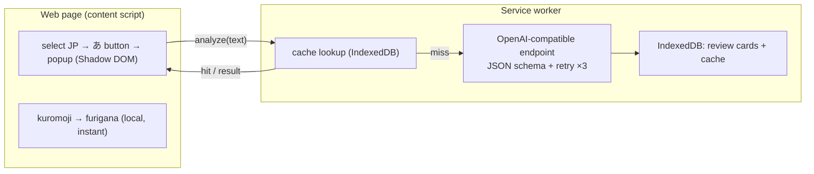

<p align="center">
  
</p>

# Assistant de lecture du japonais

> Renforcez votre compréhension écrite — sélectionnez n'importe quel texte japonais sur une page web pour obtenir instantanément les furigana ainsi qu'une analyse IA à la demande, adaptée au niveau JLPT (traduction, grammaire, vocabulaire), et transformez ce que vous étudiez en cartes à réviser.

[Deutsch](README.de.md) · [English](README.md) · [Español](README.es.md) · **Français** · [한국어](README.ko.md) · [Português](README.pt.md) · [Русский](README.ru.md) · [简体中文](README.zh-Hans.md) · [繁體中文](README.zh-Hant.md)

Une extension Chrome (Manifest V3) pour lire le japonais sur le web. Les furigana sont générés localement et instantanément ; l'explication IA ne s'exécute que lorsque vous la demandez et adapte sa profondeur à votre niveau JLPT.

## Fonctionnalités

- **Sélectionner pour apprendre** — surlignez un texte japonais et un petit bouton **あ** apparaît à côté ; cliquez pour ouvrir une fenêtre contextuelle dans la page (rendue dans un Shadow DOM, isolée de la page hôte).
- **Furigana locaux instantanés** — [kuromoji](https://github.com/takuyaa/kuromoji.js) (IPADIC) effectue la tokenisation dans le navigateur et affiche les lectures sous forme de ruby HTML au-dessus des kanji. Hors ligne, gratuit, sans tokens.
- **Explication IA à la demande** — cliquez sur **Explain with AI** pour obtenir la traduction, les points de grammaire et le vocabulaire. Elle ne s'exécute qu'au clic (aucun appel automatique), et l'IA renvoie également des furigana corrigés et adaptés au contexte qui remplacent la supposition de kuromoji pour les kanji ambigus (par ex. 「間」→ あいだ, et non ま).
- **Profondeur adaptée au JLPT** — le niveau débutant explique chaque particule et chaque conjugaison de base ; N3 suppose que les niveaux N5–N4 sont acquis et se concentre sur la grammaire N3+ ; N2/N1 ne couvre que les structures avancées ou idiomatiques.
- **Sortie structurée et fiable** — le modèle est contraint par un JSON Schema ; une sortie impossible à analyser est réessayée jusqu'à 3 fois.
- **Mise en cache et réutilisation** — les résultats sont mis en cache par contenu (texte normalisé + niveau + langue), de sorte que resélectionner la même phrase affiche instantanément l'analyse enregistrée ; un bouton **Re-analyze** force une actualisation.
- **Cartes de révision** — chaque explication est enregistrée (automatiquement, ou via un bouton **Save** lorsque l'enregistrement automatique est désactivé). La page de révision regroupe les cartes par niveau JLPT et les filtre par niveau et par langue d'explication.
- **9 langues natives** — 简体中文 / 繁體中文 / English / 한국어 / Español / Français / Deutsch / Português / Русский. Votre langue native est à la fois la langue d'explication et la langue de l'interface (via [vue-i18n](https://vue-i18n.intlify.dev/)).
- **Utilisez votre propre modèle** — n'importe quel point de terminaison compatible OpenAI, dans le cloud ou en local. Des préréglages de fournisseurs et un test de connectivité sont intégrés aux paramètres.

## Installation

Pas encore de fiche sur le store — chargez l'extension compilée en mode non empaqueté :

```bash
pnpm install
pnpm build        # outputs to dist/
```

1. Ouvrez `chrome://extensions`
2. Activez le **mode développeur**
3. **Charger l'extension non empaquetée** → sélectionnez le dossier `dist/`

> Après avoir rechargé l'extension, actualisez les pages déjà ouvertes afin que le nouveau content script soit injecté.

## Utilisation

1. Cliquez sur l'icône de la barre d'outils → définissez votre **langue native**, votre **niveau JLPT** et un **modèle** (Base URL / Model / API Key). Les points de terminaison locaux (localhost) ne nécessitent généralement aucune clé. Utilisez **Test connection** pour vérifier. Les paramètres sont enregistrés automatiquement.
2. Sur n'importe quelle page, **sélectionnez du texte japonais** → le bouton **あ** apparaît → cliquez dessus.
3. La fenêtre contextuelle affiche immédiatement le texte avec les **furigana**. Cliquez sur **Explain with AI** pour obtenir l'analyse.
4. Les explications deviennent des cartes de révision. Ouvrez **Review** depuis la fenêtre contextuelle pour les parcourir, les filtrer (niveau / langue) et les supprimer.

## Modèles

L'extension communique avec n'importe quel point de terminaison `/chat/completions` **compatible OpenAI** — une seule configuration (`Base URL`, `Model`, `API Key`) couvre à la fois le cloud et le local.

| | Example Base URL | API Key |
|---|---|---|
| **Cloud** | `https://api.openai.com/v1`, `https://api.deepseek.com/v1`, `https://dashscope.aliyuncs.com/compatible-mode/v1`, … | requise |
| **Local** | `http://localhost:11434/v1` (Ollama), `http://localhost:1234/v1` (LM Studio) | généralement aucune |

Des préréglages pour les fournisseurs courants sont intégrés aux paramètres ; les deux champs sont des zones de liste modifiables, vous pouvez donc saisir n'importe quelle valeur. Les furigana n'utilisent **pas** l'IA — ils sont produits localement par kuromoji, donc ils fonctionnent hors ligne et ne coûtent rien.

> **Note pour le local (Ollama) :** la requête provient de l'origine de l'extension. Si le test de connectivité renvoie une erreur 403/CORS, autorisez l'origine de l'extension — par ex. `launchctl setenv OLLAMA_ORIGINS "chrome-extension://*"` puis redémarrez Ollama.

## Confidentialité

- Les **furigana** sont calculés entièrement dans votre navigateur (kuromoji) — rien ne quitte votre machine.
- L'**analyse IA** envoie le texte sélectionné au point de terminaison que vous configurez. Un point de terminaison cloud signifie que le texte est envoyé à un tiers ; un point de terminaison local le conserve sur votre machine.
- Le **stockage est local** — les paramètres dans `chrome.storage.local` ; les cartes de révision et le cache d'analyse dans IndexedDB (origine de l'extension). Rien n'est téléversé ailleurs.

## Architecture

Manifest V3, construit avec **Vue 3 + Vite + [CRXJS](https://crxjs.dev/) + Tailwind CSS + TypeScript**. Quatre surfaces partagent une couche commune `src/shared` (types, paramètres, stockage, client IA, JSON schema, wrapper kuromoji, i18n, messagerie) :

- **content script** — détecte les sélections japonaises, affiche le bouton flottant **あ** et monte la fenêtre contextuelle dans un Shadow DOM. Exécute kuromoji localement pour les furigana.
- **service worker** — le seul endroit qui appelle le point de terminaison IA (l'origine de l'extension contourne le CORS de la page). Applique le JSON schema, réessaie, met les résultats en cache et écrit les cartes de révision dans IndexedDB.
- **popup** (barre d'outils) — tous les paramètres, ainsi qu'un bouton qui ouvre la page de révision.
- **options page** — les enregistrements de révision (regroupés par niveau JLPT, filtrables).



Le contrat IA se trouve dans `src/shared/schema.ts` (JSON Schema + parseur) et `src/shared/prompt.ts` (prompt système adapté au niveau). Changer de fournisseur revient simplement à utiliser une Base URL différente.
## Développement

Nécessite **pnpm**.

```bash
pnpm install
pnpm dev          # Vite dev server with HMR (load dist/ as unpacked)
pnpm build        # production build → dist/
pnpm type-check   # vue-tsc
```

- **Dictionnaire de furigana** — `scripts/copy-dict.mjs` copie le dictionnaire kuromoji depuis `node_modules` vers `public/assets/dict/` avant le dev/build (~19 Mo, non commité).
- **Icônes** — modifiez `icons/icon.svg`, puis exécutez `node scripts/generate-icons.mjs` pour régénérer les PNG (les icônes d'extension Chrome doivent être matricielles).
