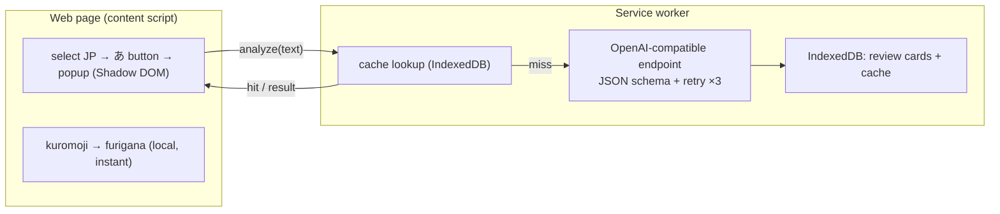

<p align="center">
  
</p>

# 일본어 읽기 도우미

> 읽기 이해력을 강화하세요 — 웹 페이지에서 일본어를 선택하기만 하면 즉시 후리가나와 함께, 요청 시 제공되는 JLPT 수준 맞춤 AI 분석(번역, 문법, 어휘)을 받아보고, 학습한 내용을 복습 카드로 전환할 수 있습니다.

[Deutsch](README.de.md) · [English](README.md) · [Español](README.es.md) · [Français](README.fr.md) · **한국어** · [Português](README.pt.md) · [Русский](README.ru.md) · [简体中文](README.zh-Hans.md) · [繁體中文](README.zh-Hant.md)

웹에서 일본어를 읽기 위한 Chrome(Manifest V3) 확장 프로그램입니다. 후리가나는 로컬에서 즉시 생성되며, AI 설명은 요청할 때만 실행되고 사용자의 JLPT 수준에 맞춰 상세도가 조정됩니다.

## 기능

- **선택하여 학습** — 일본어 텍스트를 강조 표시하면 그 옆에 작은 **あ** 버튼이 나타납니다. 클릭하면 페이지 내 팝업(Shadow DOM으로 렌더링되어 호스트 페이지와 격리됨)이 열립니다.
- **즉시 로컬 후리가나** — [kuromoji](https://github.com/takuyaa/kuromoji.js)(IPADIC)가 브라우저에서 토큰화하여 한자 위에 HTML ruby로 읽기를 렌더링합니다. 오프라인, 무료, 토큰 소모 없음.
- **요청 시 AI 설명** — **Explain with AI**를 클릭하면 번역, 문법 포인트, 어휘를 제공합니다. 클릭할 때만 실행되며(자동 호출 없음), AI는 또한 문맥에 맞게 수정된 후리가나를 반환하여 애매한 한자에 대한 kuromoji의 추측을 덮어씁니다(예: 「間」→ あいだ, ま가 아님).
- **JLPT 수준 맞춤 상세도** — 초급은 모든 조사와 기본 활용을 설명하고, N3은 N5–N4를 안다고 가정하며 N3+ 문법에 집중하고, N2/N1은 고급/관용 표현 구조만 다룹니다.
- **구조화되고 신뢰할 수 있는 출력** — 모델은 JSON Schema로 제약되며, 파싱할 수 없는 출력은 최대 3회까지 재시도합니다.
- **캐시 및 재사용** — 결과는 콘텐츠(정규화된 텍스트 + 수준 + 언어)별로 캐시되므로, 같은 문장을 다시 선택하면 저장된 분석이 즉시 표시됩니다. **Re-analyze** 버튼으로 강제 새로 고침할 수 있습니다.
- **복습 카드** — 모든 설명이 기록됩니다(자동, 또는 자동 기록이 꺼져 있을 때는 **Save** 버튼으로). 복습 페이지는 JLPT 수준별로 카드를 그룹화하고 수준 및 설명 언어로 필터링합니다.
- **9개 모국어** — 简体中文 / 繁體中文 / English / 한국어 / Español / Français / Deutsch / Português / Русский. 모국어는 설명 언어이자 UI 언어입니다([vue-i18n](https://vue-i18n.intlify.dev/)를 통해).
- **자신의 모델 사용** — 클라우드든 로컬이든 모든 OpenAI 호환 엔드포인트를 사용할 수 있습니다. 제공자 프리셋과 연결 테스트가 설정에 내장되어 있습니다.

## 설치

아직 스토어에 등록되지 않았습니다 — 빌드된 확장 프로그램을 압축 해제된 상태로 로드하세요:

```bash
pnpm install
pnpm build        # outputs to dist/
```

1. `chrome://extensions`를 엽니다
2. **개발자 모드**를 활성화합니다
3. **압축 해제된 확장 프로그램을 로드**를 클릭하고 `dist/` 폴더를 선택합니다

> 확장 프로그램을 다시 로드한 후에는 이미 열려 있는 페이지를 새로 고쳐 새 content script가 삽입되도록 하세요.

## 사용법

1. 툴바 아이콘을 클릭하여 **모국어**, **JLPT 수준**, **모델**(Base URL / Model / API Key)을 설정합니다. 로컬 엔드포인트(localhost)는 일반적으로 키가 필요 없습니다. **Test connection**으로 확인하세요. 설정은 자동으로 저장됩니다.
2. 아무 페이지에서나 **일본어 텍스트를 선택**하면 **あ** 버튼이 나타납니다. 클릭하세요.
3. 팝업에 텍스트와 **후리가나**가 즉시 표시됩니다. **Explain with AI**를 클릭하면 분석을 볼 수 있습니다.
4. 설명은 복습 카드가 됩니다. 팝업에서 **Review**를 열어 탐색하고, 필터링(수준 / 언어)하고, 삭제할 수 있습니다.

## 모델

이 확장 프로그램은 모든 **OpenAI 호환** `/chat/completions` 엔드포인트와 통신합니다 — 하나의 설정(`Base URL`, `Model`, `API Key`)으로 클라우드와 로컬을 모두 처리합니다.

| | Example Base URL | API Key |
|---|---|---|
| **클라우드** | `https://api.openai.com/v1`, `https://api.deepseek.com/v1`, `https://dashscope.aliyuncs.com/compatible-mode/v1`, … | 필수 |
| **로컬** | `http://localhost:11434/v1` (Ollama), `http://localhost:1234/v1` (LM Studio) | 대개 불필요 |

일반적인 제공자용 프리셋이 설정에 내장되어 있습니다. 두 필드 모두 편집 가능한 콤보박스이므로 어떤 값이든 입력할 수 있습니다. 후리가나는 AI를 **사용하지 않습니다** — kuromoji가 로컬에서 생성하므로 오프라인에서도 작동하고 비용이 들지 않습니다.

> **로컬(Ollama) 참고:** 요청은 확장 프로그램의 origin에서 발생합니다. 연결 테스트가 403/CORS 오류를 반환하면 확장 프로그램 origin을 허용하세요 — 예: `launchctl setenv OLLAMA_ORIGINS "chrome-extension://*"`를 실행한 후 Ollama를 다시 시작합니다.

## 개인정보 보호

- **후리가나**는 전적으로 브라우저 내에서 계산됩니다(kuromoji) — 아무것도 사용자의 기기를 떠나지 않습니다.
- **AI 분석**은 선택한 텍스트를 사용자가 설정한 엔드포인트로 전송합니다. 클라우드 엔드포인트는 텍스트가 제3자에게 전송됨을 의미하고, 로컬 엔드포인트는 텍스트를 사용자의 기기에 유지합니다.
- **저장소는 로컬입니다** — 설정은 `chrome.storage.local`에, 복습 카드와 분석 캐시는 IndexedDB(확장 프로그램 origin)에 저장됩니다. 다른 곳으로 아무것도 업로드되지 않습니다.

## 아키텍처

Manifest V3, **Vue 3 + Vite + [CRXJS](https://crxjs.dev/) + Tailwind CSS + TypeScript**로 구축되었습니다. 네 개의 표면이 공통 `src/shared` 계층(타입, 설정, 저장소, AI 클라이언트, JSON 스키마, kuromoji 래퍼, i18n, 메시징)을 공유합니다:

- **content script** — 일본어 선택을 감지하고, 떠 있는 **あ** 버튼을 표시하며, Shadow DOM 내부에 팝업을 마운트합니다. 후리가나를 위해 kuromoji를 로컬에서 실행합니다.
- **service worker** — AI 엔드포인트를 호출하는 유일한 곳입니다(확장 프로그램 origin은 페이지 CORS를 우회합니다). JSON 스키마를 강제하고, 재시도하며, 결과를 캐시하고, 복습 카드를 IndexedDB에 기록합니다.
- **popup**(툴바) — 모든 설정과 복습 페이지를 여는 버튼이 있습니다.
- **options page** — 복습 기록(JLPT 수준별로 그룹화, 필터링 가능)입니다.



AI 계약은 `src/shared/schema.ts`(JSON Schema + 파서)와 `src/shared/prompt.ts`(수준 인식 시스템 프롬프트)에 있습니다. 제공자를 교체하는 것은 단지 다른 Base URL을 쓰는 것뿐입니다. 전체 설계 노트는 [`docs/dev-memory/architecture.md`](docs/dev-memory/architecture.md)를 참조하세요.

## 개발

**pnpm**이 필요합니다.

```bash
pnpm install
pnpm dev          # Vite dev server with HMR (load dist/ as unpacked)
pnpm build        # production build → dist/
pnpm type-check   # vue-tsc
```

- **후리가나 사전** — `scripts/copy-dict.mjs`가 dev/build 전에 kuromoji 사전을 `node_modules`에서 `public/assets/dict/`로 복사합니다(~19 MB, 커밋되지 않음).
- **아이콘** — `icons/icon.svg`를 편집한 다음 `node scripts/generate-icons.mjs`를 실행하여 PNG를 다시 생성하세요(Chrome 확장 프로그램 아이콘은 래스터여야 합니다).
