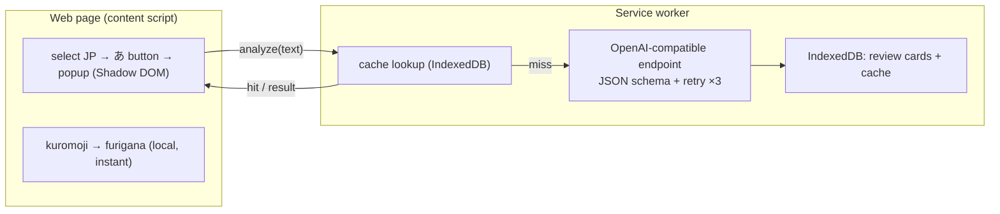

<p align="center">
  
</p>

# Japanese Reading Assistant

> Strengthen your reading comprehension — select any Japanese on a web page to get instant furigana plus an on-demand, JLPT-aware AI breakdown (translation, grammar, vocabulary), and turn what you study into reviewable cards.

[Deutsch](README.de.md) · **English** · [Español](README.es.md) · [Français](README.fr.md) · [한국어](README.ko.md) · [Português](README.pt.md) · [Русский](README.ru.md) · [简体中文](README.zh-Hans.md) · [繁體中文](README.zh-Hant.md)

A Chrome (Manifest V3) extension for reading Japanese on the web. Furigana is generated locally and instantly; the AI explanation runs only when you ask for it and adapts its depth to your JLPT level.

## Features

- **Select to learn** — highlight Japanese text and a small **あ** button appears next to it; click to open an in-page popup (rendered in a Shadow DOM, isolated from the host page).
- **Instant local furigana** — [kuromoji](https://github.com/takuyaa/kuromoji.js) (IPADIC) tokenizes in the browser and renders readings as HTML ruby over kanji. Offline, free, no tokens.
- **On-demand AI explanation** — click **Explain with AI** for the translation, grammar points, and vocabulary. It runs only on click (no automatic calls), and the AI also returns corrected, context-aware furigana that overrides kuromoji's guess for ambiguous kanji (e.g. 「間」→ あいだ, not ま).
- **JLPT-aware depth** — Beginner explains every particle and basic conjugation; N3 assumes N5–N4 is known and focuses on N3+ grammar; N2/N1 only covers advanced/idiomatic structures.
- **Structured, reliable output** — the model is constrained by a JSON Schema; unparseable output is retried up to 3 times.
- **Cache & reuse** — results are cached by content (normalized text + level + language), so re-selecting the same sentence shows the saved analysis instantly; a **Re-analyze** button forces a refresh.
- **Review cards** — every explanation is recorded (automatically, or via a **Save** button when auto-record is off). The review page groups cards by JLPT level and filters by level and explanation language.
- **9 native languages** — 简体中文 / 繁體中文 / English / 한국어 / Español / Français / Deutsch / Português / Русский. Your native language is both the explanation language and the UI language (via [vue-i18n](https://vue-i18n.intlify.dev/)).
- **Bring your own model** — any OpenAI-compatible endpoint, cloud or local. Provider presets and a connectivity test are built into Settings.

## Install

No store listing yet — load the built extension unpacked:

```bash
pnpm install
pnpm build        # outputs to dist/
```

1. Open `chrome://extensions`
2. Enable **Developer mode**
3. **Load unpacked** → select the `dist/` folder

> After reloading the extension, refresh any already-open pages so the new content script is injected.

## Usage

1. Click the toolbar icon → set your **native language**, **JLPT level**, and a **model** (Base URL / Model / API Key). Local endpoints (localhost) usually need no key. Use **Test connection** to verify. Settings save automatically.
2. On any page, **select Japanese text** → the **あ** button appears → click it.
3. The popup shows the text with **furigana** immediately. Click **Explain with AI** for the breakdown.
4. Explanations become review cards. Open **Review** from the popup to browse, filter (level / language), and delete them.

## Models

The extension talks to any **OpenAI-compatible** `/chat/completions` endpoint — one config (`Base URL`, `Model`, `API Key`) covers both cloud and local.

| | Example Base URL | API Key |
|---|---|---|
| **Cloud** | `https://api.openai.com/v1`, `https://api.deepseek.com/v1`, `https://dashscope.aliyuncs.com/compatible-mode/v1`, … | required |
| **Local** | `http://localhost:11434/v1` (Ollama), `http://localhost:1234/v1` (LM Studio) | usually none |

Presets for common providers are built into Settings; both fields are editable comboboxes, so you can type any value. Furigana does **not** use the AI — it's produced locally by kuromoji, so it works offline and costs nothing.

> **Local (Ollama) note:** the request originates from the extension's origin. If the connectivity test returns a 403/CORS error, allow the extension origin — e.g. `launchctl setenv OLLAMA_ORIGINS "chrome-extension://*"` then restart Ollama.

## Privacy

- **Furigana** is computed entirely in your browser (kuromoji) — nothing leaves your machine.
- **AI analysis** sends the selected text to the endpoint you configure. A cloud endpoint means the text is sent to a third party; a local endpoint keeps it on your machine.
- **Storage is local** — settings in `chrome.storage.local`; review cards and the analysis cache in IndexedDB (extension origin). Nothing is uploaded elsewhere.

## Architecture

Manifest V3, built with **Vue 3 + Vite + [CRXJS](https://crxjs.dev/) + Tailwind CSS + TypeScript**. Four surfaces share a common `src/shared` layer (types, settings, storage, AI client, JSON schema, kuromoji wrapper, i18n, messaging):

- **content script** — detects Japanese selections, shows the floating **あ** button, and mounts the popup inside a Shadow DOM. Runs kuromoji locally for furigana.
- **service worker** — the only place that calls the AI endpoint (the extension origin bypasses page CORS). Enforces the JSON schema, retries, caches results, and writes review cards to IndexedDB.
- **popup** (toolbar) — all settings, plus a button that opens the review page.
- **options page** — the review records (grouped by JLPT level, filterable).



The AI contract lives in `src/shared/schema.ts` (JSON Schema + parser) and `src/shared/prompt.ts` (level-aware system prompt). Swapping providers is just a different Base URL.
## Development

Requires **pnpm**.

```bash
pnpm install
pnpm dev          # Vite dev server with HMR (load dist/ as unpacked)
pnpm build        # production build → dist/
pnpm type-check   # vue-tsc
```

- **Furigana dictionary** — `scripts/copy-dict.mjs` copies the kuromoji dictionary from `node_modules` into `public/assets/dict/` before dev/build (~19 MB, not committed).
- **Icons** — edit `icons/icon.svg`, then run `node scripts/generate-icons.mjs` to regenerate the PNGs (Chrome extension icons must be raster).
