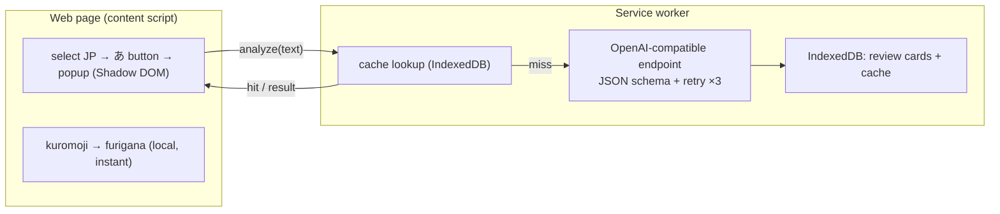

<p align="center">
  
</p>

# Assistente de leitura de japonês

> Reforce sua compreensão de leitura — selecione qualquer texto em japonês numa página web para obter furigana instantâneo e uma análise por IA sob demanda e adaptada ao JLPT (tradução, gramática, vocabulário), e transforme o que você estuda em cartões revisáveis.

[Deutsch](README.de.md) · [English](README.md) · [Español](README.es.md) · [Français](README.fr.md) · [한국어](README.ko.md) · **Português** · [Русский](README.ru.md) · [简体中文](README.zh-Hans.md) · [繁體中文](README.zh-Hant.md)

Uma extensão para Chrome (Manifest V3) para ler japonês na web. O furigana é gerado localmente e de forma instantânea; a explicação por IA é executada somente quando você a solicita e adapta sua profundidade ao seu nível JLPT.

## Recursos

- **Selecione para aprender** — destaque um texto em japonês e um pequeno botão **あ** aparece ao lado dele; clique para abrir um popup na página (renderizado em um Shadow DOM, isolado da página anfitriã).
- **Furigana local instantâneo** — o [kuromoji](https://github.com/takuyaa/kuromoji.js) (IPADIC) tokeniza no navegador e renderiza as leituras como ruby HTML sobre os kanji. Offline, gratuito, sem tokens.
- **Explicação por IA sob demanda** — clique em **Explain with AI** para obter a tradução, os pontos gramaticais e o vocabulário. Ela roda apenas ao clicar (sem chamadas automáticas), e a IA também retorna furigana corrigido e ciente do contexto, que substitui o palpite do kuromoji para kanji ambíguos (por exemplo, 「間」→ あいだ, não ま).
- **Profundidade ciente do JLPT** — Iniciante explica cada partícula e conjugação básica; N3 assume que N5–N4 já é conhecido e foca na gramática N3+; N2/N1 cobre apenas estruturas avançadas/idiomáticas.
- **Saída estruturada e confiável** — o modelo é restringido por um JSON Schema; saída não interpretável é repetida até 3 vezes.
- **Cache e reutilização** — os resultados são armazenados em cache por conteúdo (texto normalizado + nível + idioma), então reselecionar a mesma frase mostra a análise salva instantaneamente; um botão **Re-analyze** força uma atualização.
- **Cartões de revisão** — cada explicação é registrada (automaticamente, ou por meio de um botão **Save** quando o registro automático está desativado). A página de revisão agrupa os cartões por nível JLPT e filtra por nível e por idioma da explicação.
- **9 idiomas nativos** — 简体中文 / 繁體中文 / English / 한국어 / Español / Français / Deutsch / Português / Русский. Seu idioma nativo é tanto o idioma da explicação quanto o idioma da interface (via [vue-i18n](https://vue-i18n.intlify.dev/)).
- **Traga seu próprio modelo** — qualquer endpoint compatível com OpenAI, na nuvem ou local. Predefinições de provedores e um teste de conectividade estão integrados nas Configurações.

## Instalação

Ainda não há listagem na loja — carregue a extensão compilada de forma descompactada:

```bash
pnpm install
pnpm build        # outputs to dist/
```

1. Abra `chrome://extensions`
2. Ative o **Modo de desenvolvedor**
3. **Carregar sem compactação** → selecione a pasta `dist/`

> Após recarregar a extensão, atualize quaisquer páginas já abertas para que o novo content script seja injetado.

## Uso

1. Clique no ícone da barra de ferramentas → defina seu **idioma nativo**, seu **nível JLPT** e um **modelo** (Base URL / Model / API Key). Endpoints locais (localhost) geralmente não precisam de chave. Use **Test connection** para verificar. As configurações são salvas automaticamente.
2. Em qualquer página, **selecione um texto em japonês** → o botão **あ** aparece → clique nele.
3. O popup mostra o texto com **furigana** imediatamente. Clique em **Explain with AI** para obter a análise.
4. As explicações se tornam cartões de revisão. Abra **Review** a partir do popup para navegar, filtrar (nível / idioma) e excluí-los.

## Modelos

A extensão se comunica com qualquer endpoint `/chat/completions` **compatível com OpenAI** — uma única configuração (`Base URL`, `Model`, `API Key`) cobre tanto a nuvem quanto o local.

| | Example Base URL | API Key |
|---|---|---|
| **Nuvem** | `https://api.openai.com/v1`, `https://api.deepseek.com/v1`, `https://dashscope.aliyuncs.com/compatible-mode/v1`, … | obrigatória |
| **Local** | `http://localhost:11434/v1` (Ollama), `http://localhost:1234/v1` (LM Studio) | geralmente nenhuma |

Predefinições para provedores comuns estão integradas nas Configurações; ambos os campos são comboboxes editáveis, então você pode digitar qualquer valor. O furigana **não** usa a IA — ele é produzido localmente pelo kuromoji, portanto funciona offline e não custa nada.

> **Nota sobre local (Ollama):** a requisição se origina da origem da extensão. Se o teste de conectividade retornar um erro 403/CORS, permita a origem da extensão — por exemplo, `launchctl setenv OLLAMA_ORIGINS "chrome-extension://*"` e depois reinicie o Ollama.

## Privacidade

- O **furigana** é calculado inteiramente no seu navegador (kuromoji) — nada sai da sua máquina.
- A **análise por IA** envia o texto selecionado para o endpoint que você configurar. Um endpoint na nuvem significa que o texto é enviado a um terceiro; um endpoint local o mantém na sua máquina.
- O **armazenamento é local** — configurações em `chrome.storage.local`; cartões de revisão e o cache de análise no IndexedDB (origem da extensão). Nada é enviado para outro lugar.

## Arquitetura

Manifest V3, construído com **Vue 3 + Vite + [CRXJS](https://crxjs.dev/) + Tailwind CSS + TypeScript**. Quatro superfícies compartilham uma camada comum `src/shared` (tipos, configurações, armazenamento, cliente de IA, JSON schema, wrapper do kuromoji, i18n, mensageria):

- **content script** — detecta seleções em japonês, mostra o botão flutuante **あ** e monta o popup dentro de um Shadow DOM. Executa o kuromoji localmente para o furigana.
- **service worker** — o único lugar que chama o endpoint de IA (a origem da extensão contorna o CORS da página). Impõe o JSON schema, faz novas tentativas, armazena os resultados em cache e grava os cartões de revisão no IndexedDB.
- **popup** (barra de ferramentas) — todas as configurações, além de um botão que abre a página de revisão.
- **options page** — os registros de revisão (agrupados por nível JLPT, filtráveis).



O contrato da IA reside em `src/shared/schema.ts` (JSON Schema + parser) e `src/shared/prompt.ts` (prompt de sistema ciente do nível). Trocar de provedor é apenas uma Base URL diferente.
## Desenvolvimento

Requer **pnpm**.

```bash
pnpm install
pnpm dev          # Vite dev server with HMR (load dist/ as unpacked)
pnpm build        # production build → dist/
pnpm type-check   # vue-tsc
```

- **Dicionário do furigana** — `scripts/copy-dict.mjs` copia o dicionário do kuromoji de `node_modules` para `public/assets/dict/` antes do dev/build (~19 MB, não versionado).
- **Ícones** — edite `icons/icon.svg`, depois execute `node scripts/generate-icons.mjs` para regenerar os PNGs (os ícones de extensão do Chrome devem ser raster).
