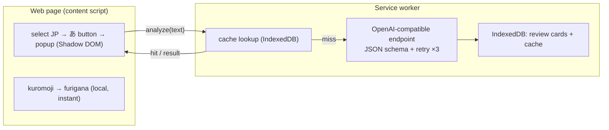

<p align="center">
  
</p>

# Помощник по чтению на японском

> Развивайте навык понимания прочитанного — выделите любой японский текст на веб-странице, чтобы мгновенно получить фуригану, а также разбор от ИИ по запросу с учётом уровня JLPT (перевод, грамматика, лексика), и превращайте изученное в карточки для повторения.

[Deutsch](README.de.md) · [English](README.md) · [Español](README.es.md) · [Français](README.fr.md) · [한국어](README.ko.md) · [Português](README.pt.md) · **Русский** · [简体中文](README.zh-Hans.md) · [繁體中文](README.zh-Hant.md)

Расширение для Chrome (Manifest V3) для чтения японских текстов в интернете. Фуригана генерируется локально и мгновенно; объяснение от ИИ выполняется только по вашему запросу и подстраивает уровень детализации под ваш уровень JLPT.

## Возможности

- **Выделите, чтобы учиться** — выделите японский текст, и рядом появится небольшая кнопка **あ**; нажмите её, чтобы открыть всплывающее окно прямо на странице (отрисовывается в Shadow DOM, изолированно от страницы-хоста).
- **Мгновенная локальная фуригана** — [kuromoji](https://github.com/takuyaa/kuromoji.js) (IPADIC) выполняет токенизацию в браузере и отображает чтения как HTML ruby над кандзи. Офлайн, бесплатно, без токенов.
- **Объяснение от ИИ по запросу** — нажмите **Explain with AI**, чтобы получить перевод, грамматические моменты и лексику. Оно выполняется только по нажатию (без автоматических вызовов), и ИИ также возвращает исправленную, учитывающую контекст фуригану, которая переопределяет предположение kuromoji для неоднозначных кандзи (например, 「間」→ あいだ, а не ま).
- **Глубина с учётом JLPT** — уровень для начинающих объясняет каждую частицу и базовое спряжение; N3 предполагает, что N5–N4 уже известны, и фокусируется на грамматике уровня N3 и выше; N2/N1 охватывают только продвинутые/идиоматические конструкции.
- **Структурированный, надёжный вывод** — модель ограничена JSON Schema; вывод, который не удаётся разобрать, повторяется до 3 раз.
- **Кэширование и повторное использование** — результаты кэшируются по содержимому (нормализованный текст + уровень + язык), поэтому при повторном выделении того же предложения сохранённый анализ показывается мгновенно; кнопка **Re-analyze** принудительно обновляет результат.
- **Карточки для повторения** — каждое объяснение записывается (автоматически или с помощью кнопки **Save**, когда автозапись отключена). Страница повторения группирует карточки по уровню JLPT и фильтрует их по уровню и языку объяснения.
- **9 родных языков** — 简体中文 / 繁體中文 / English / 한국어 / Español / Français / Deutsch / Português / Русский. Ваш родной язык является одновременно языком объяснений и языком интерфейса (через [vue-i18n](https://vue-i18n.intlify.dev/)).
- **Используйте свою модель** — любой OpenAI-совместимый эндпоинт, облачный или локальный. Предустановки провайдеров и проверка соединения встроены в настройки.

## Установка

Пока нет в магазине — загрузите собранное расширение распакованным:

```bash
pnpm install
pnpm build        # outputs to dist/
```

1. Откройте `chrome://extensions`
2. Включите **Режим разработчика**
3. **Загрузите распакованное расширение** → выберите папку `dist/`

> После перезагрузки расширения обновите все уже открытые страницы, чтобы был внедрён новый content script.

## Использование

1. Нажмите на значок расширения на панели инструментов → задайте свой **родной язык**, **уровень JLPT** и **модель** (Base URL / Model / API Key). Локальным эндпоинтам (localhost) обычно ключ не нужен. Используйте **Test connection** для проверки. Настройки сохраняются автоматически.
2. На любой странице **выделите японский текст** → появится кнопка **あ** → нажмите её.
3. Всплывающее окно сразу показывает текст с **фуриганой**. Нажмите **Explain with AI**, чтобы получить разбор.
4. Объяснения становятся карточками для повторения. Откройте **Review** из всплывающего окна, чтобы просматривать, фильтровать (уровень / язык) и удалять их.

## Модели

Расширение работает с любым **OpenAI-совместимым** эндпоинтом `/chat/completions` — одна конфигурация (`Base URL`, `Model`, `API Key`) охватывает и облако, и локальный запуск.

| | Example Base URL | API Key |
|---|---|---|
| **Облако** | `https://api.openai.com/v1`, `https://api.deepseek.com/v1`, `https://dashscope.aliyuncs.com/compatible-mode/v1`, … | обязателен |
| **Локально** | `http://localhost:11434/v1` (Ollama), `http://localhost:1234/v1` (LM Studio) | обычно не нужен |

Предустановки для распространённых провайдеров встроены в настройки; оба поля представляют собой редактируемые комбинированные списки, поэтому вы можете ввести любое значение. Фуригана **не** использует ИИ — она создаётся локально с помощью kuromoji, поэтому работает офлайн и ничего не стоит.

> **Примечание для локального запуска (Ollama):** запрос исходит из origin расширения. Если проверка соединения возвращает ошибку 403/CORS, разрешите origin расширения — например, `launchctl setenv OLLAMA_ORIGINS "chrome-extension://*"`, затем перезапустите Ollama.

## Конфиденциальность

- **Фуригана** вычисляется полностью в вашем браузере (kuromoji) — ничего не покидает вашу машину.
- **Анализ ИИ** отправляет выделенный текст на настроенный вами эндпоинт. Облачный эндпоинт означает, что текст отправляется третьей стороне; локальный эндпоинт оставляет его на вашей машине.
- **Хранение локально** — настройки в `chrome.storage.local`; карточки для повторения и кэш анализа в IndexedDB (origin расширения). Ничего не загружается куда-либо ещё.

## Архитектура

Manifest V3, собрано на **Vue 3 + Vite + [CRXJS](https://crxjs.dev/) + Tailwind CSS + TypeScript**. Четыре компонента используют общий слой `src/shared` (типы, настройки, хранилище, клиент ИИ, JSON schema, обёртка kuromoji, i18n, обмен сообщениями):

- **content script** — обнаруживает выделения на японском, показывает плавающую кнопку **あ** и монтирует всплывающее окно внутри Shadow DOM. Запускает kuromoji локально для фуриганы.
- **service worker** — единственное место, которое вызывает эндпоинт ИИ (origin расширения обходит CORS страницы). Обеспечивает соблюдение JSON schema, повторные попытки, кэширует результаты и записывает карточки для повторения в IndexedDB.
- **popup** (панель инструментов) — все настройки, а также кнопка, открывающая страницу повторения.
- **options page** — записи повторения (сгруппированы по уровню JLPT, с фильтрацией).



Контракт ИИ находится в `src/shared/schema.ts` (JSON Schema + парсер) и `src/shared/prompt.ts` (системный промпт с учётом уровня). Смена провайдеров — это просто другой Base URL.
## Разработка

Требуется **pnpm**.

```bash
pnpm install
pnpm dev          # Vite dev server with HMR (load dist/ as unpacked)
pnpm build        # production build → dist/
pnpm type-check   # vue-tsc
```

- **Словарь фуриганы** — `scripts/copy-dict.mjs` копирует словарь kuromoji из `node_modules` в `public/assets/dict/` перед dev/build (~19 МБ, не коммитится).
- **Значки** — отредактируйте `icons/icon.svg`, затем выполните `node scripts/generate-icons.mjs`, чтобы перегенерировать PNG-файлы (значки расширения Chrome должны быть растровыми).
