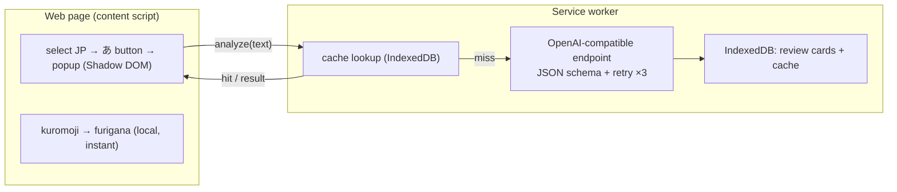

<p align="center">
  
</p>

# 日语阅读助手

> 提升你的阅读理解能力——在网页上选中任意日语文本，即可即时获得振假名，以及按需生成、贴合 JLPT 等级的 AI 解析（翻译、语法、词汇），并把学到的内容转化为可复习的卡片。

[Deutsch](README.de.md) · [English](README.md) · [Español](README.es.md) · [Français](README.fr.md) · [한국어](README.ko.md) · [Português](README.pt.md) · [Русский](README.ru.md) · **简体中文** · [繁體中文](README.zh-Hant.md)

一款用于在网页上阅读日语的 Chrome（Manifest V3）扩展。振假名在本地即时生成；AI 解析仅在你主动请求时运行，并会根据你的 JLPT 等级调整讲解的深度。

## 功能特性

- **选中即学** —— 高亮选中日语文本后，旁边会出现一个小小的 **あ** 按钮；点击即可打开页内弹窗（在 Shadow DOM 中渲染，与宿主页面相互隔离）。
- **即时本地振假名** —— [kuromoji](https://github.com/takuyaa/kuromoji.js)（IPADIC）在浏览器中完成分词，并以 HTML ruby 的形式将读音标注在汉字之上。离线可用、免费、不消耗 token。
- **按需 AI 解析** —— 点击 **Explain with AI** 即可获得翻译、语法要点和词汇。它仅在点击时运行（不会自动调用），并且 AI 还会返回修正后的、结合上下文的振假名，覆盖 kuromoji 对多音汉字的猜测（例如「間」→ あいだ，而非 ま）。
- **贴合 JLPT 等级的深度** —— 初学者模式会讲解每一个助词和基础活用；N3 假设你已掌握 N5–N4，重点讲解 N3 及以上的语法；N2/N1 只讲解高级或惯用的结构。
- **结构化、可靠的输出** —— 模型受 JSON Schema 约束；无法解析的输出最多重试 3 次。
- **缓存与复用** —— 结果会按内容（归一化文本 + 等级 + 语言）缓存，因此再次选中同一句子时会即时显示已保存的解析；**Re-analyze** 按钮可强制刷新。
- **复习卡片** —— 每一次解析都会被记录（自动记录，或在关闭自动记录时通过 **Save** 按钮记录）。复习页面按 JLPT 等级分组，并可按等级和解析语言筛选。
- **9 种母语** —— 简体中文 / 繁體中文 / English / 한국어 / Español / Français / Deutsch / Português / Русский。你的母语既是解析语言，也是界面语言（通过 [vue-i18n](https://vue-i18n.intlify.dev/)）。
- **自带模型** —— 任意 OpenAI 兼容端点，云端或本地皆可。Settings 内置了服务商预设和连通性测试。

## 安装

暂无商店上架版本——请以未打包方式加载已构建的扩展：

```bash
pnpm install
pnpm build        # outputs to dist/
```

1. 打开 `chrome://extensions`
2. 启用 **Developer mode**
3. **Load unpacked** → 选择 `dist/` 文件夹

> 重新加载扩展后，请刷新所有已打开的页面，以便注入新的 content script。

## 使用方法

1. 点击工具栏图标 → 设置你的**母语**、**JLPT 等级**和一个**模型**（Base URL / Model / API Key）。本地端点（localhost）通常无需 key。使用 **Test connection** 进行验证。设置会自动保存。
2. 在任意页面上，**选中日语文本** → 出现 **あ** 按钮 → 点击它。
3. 弹窗会立即显示带**振假名**的文本。点击 **Explain with AI** 获取详细解析。
4. 解析会成为复习卡片。从弹窗中打开 **Review** 即可浏览、筛选（等级 / 语言）和删除它们。

## 模型

该扩展与任意 **OpenAI 兼容**的 `/chat/completions` 端点通信——一份配置（`Base URL`、`Model`、`API Key`）即可同时涵盖云端和本地。

| | Example Base URL | API Key |
|---|---|---|
| **云端** | `https://api.openai.com/v1`, `https://api.deepseek.com/v1`, `https://dashscope.aliyuncs.com/compatible-mode/v1`, … | 必填 |
| **本地** | `http://localhost:11434/v1` (Ollama), `http://localhost:1234/v1` (LM Studio) | 通常无需 |

Settings 内置了常见服务商的预设；两个字段都是可编辑的下拉组合框，你也可以输入任意值。振假名**不**使用 AI——它由 kuromoji 在本地生成，因此离线可用且零成本。

> **本地（Ollama）注意事项：** 请求来自扩展的 origin。如果连通性测试返回 403/CORS 错误，请允许该扩展的 origin——例如 `launchctl setenv OLLAMA_ORIGINS "chrome-extension://*"`，然后重启 Ollama。

## 隐私

- **振假名**完全在你的浏览器中计算（kuromoji）——没有任何数据离开你的设备。
- **AI 解析**会将选中的文本发送到你配置的端点。云端端点意味着文本会被发送给第三方；本地端点则将文本保留在你的设备上。
- **存储在本地** —— 设置保存在 `chrome.storage.local`；复习卡片和解析缓存保存在 IndexedDB（扩展 origin）。不会向其他任何地方上传数据。

## 架构

Manifest V3，基于 **Vue 3 + Vite + [CRXJS](https://crxjs.dev/) + Tailwind CSS + TypeScript** 构建。四个界面共享一个公共的 `src/shared` 层（类型、设置、存储、AI 客户端、JSON schema、kuromoji 封装、i18n、消息通信）：

- **content script** —— 检测日语选区，显示浮动的 **あ** 按钮，并在 Shadow DOM 内挂载弹窗。在本地运行 kuromoji 以生成振假名。
- **service worker** —— 唯一调用 AI 端点的地方（扩展 origin 可绕过页面 CORS）。它强制执行 JSON schema、重试、缓存结果，并将复习卡片写入 IndexedDB。
- **popup**（工具栏）—— 全部设置，以及一个打开复习页面的按钮。
- **options page** —— 复习记录（按 JLPT 等级分组，可筛选）。



AI 契约位于 `src/shared/schema.ts`（JSON Schema + 解析器）和 `src/shared/prompt.ts`（贴合等级的系统提示词）。切换服务商只需换一个 Base URL。
## 开发

需要 **pnpm**。

```bash
pnpm install
pnpm dev          # Vite dev server with HMR (load dist/ as unpacked)
pnpm build        # production build → dist/
pnpm type-check   # vue-tsc
```

- **振假名词典** —— `scripts/copy-dict.mjs` 会在 dev/build 之前将 kuromoji 词典从 `node_modules` 复制到 `public/assets/dict/`（约 19 MB，未提交到仓库）。
- **图标** —— 编辑 `icons/icon.svg`，然后运行 `node scripts/generate-icons.mjs` 重新生成 PNG（Chrome 扩展图标必须是位图）。
