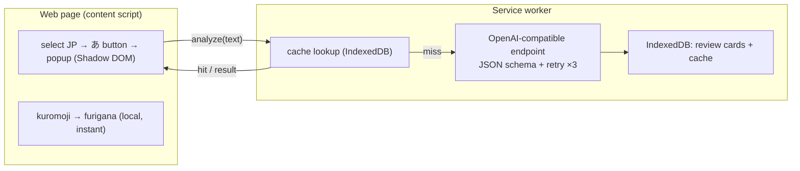

<p align="center">
  
</p>

# 日語閱讀助手

> 強化你的閱讀理解能力——在網頁上選取任何日語，即可立即取得振假名，以及依需求觸發、因應 JLPT 等級的 AI 拆解（翻譯、文法、詞彙），並把你所學的內容轉化為可複習的卡片。

[Deutsch](README.de.md) · [English](README.md) · [Español](README.es.md) · [Français](README.fr.md) · [한국어](README.ko.md) · [Português](README.pt.md) · [Русский](README.ru.md) · [简体中文](README.zh-Hans.md) · **繁體中文**

一款用於在網頁上閱讀日語的 Chrome（Manifest V3）擴充功能。振假名在本機即時產生；AI 說明只在你主動要求時才執行，並會依你的 JLPT 等級調整詳盡程度。

## 功能特色

- **選取即學** — 標示日語文字後，旁邊會出現一個小小的 **あ** 按鈕；點擊即可開啟頁內彈出視窗（渲染於 Shadow DOM 中，與宿主頁面隔離）。
- **本機即時振假名** — [kuromoji](https://github.com/takuyaa/kuromoji.js)（IPADIC）在瀏覽器中斷詞，並以 HTML ruby 的形式將讀音標註在漢字之上。離線、免費、不耗用 token。
- **依需求觸發的 AI 說明** — 點擊 **Explain with AI** 取得翻譯、文法要點與詞彙。它只在點擊時執行（不會自動呼叫），而且 AI 還會回傳經過修正、貼合上下文的振假名，覆蓋 kuromoji 對歧義漢字的猜測（例如「間」→ あいだ，而非 ま）。
- **因應 JLPT 等級的詳盡度** — 初級會解釋每個助詞與基本活用；N3 則假設你已掌握 N5–N4，聚焦於 N3 以上的文法；N2/N1 只涵蓋進階／慣用的結構。
- **結構化、可靠的輸出** — 模型受 JSON Schema 約束；無法解析的輸出最多重試 3 次。
- **快取與重用** — 結果會依內容（正規化後的文字 + 等級 + 語言）快取，因此再次選取同一句子時會立即顯示已儲存的分析；**Re-analyze** 按鈕可強制重新整理。
- **複習卡片** — 每一則說明都會被記錄下來（自動記錄，或在關閉自動記錄時透過 **Save** 按鈕記錄）。複習頁面會依 JLPT 等級將卡片分組，並可依等級與說明語言篩選。
- **9 種母語** — 简体中文 / 繁體中文 / English / 한국어 / Español / Français / Deutsch / Português / Русский。你的母語同時是說明語言與介面語言（透過 [vue-i18n](https://vue-i18n.intlify.dev/)）。
- **自備模型** — 任何相容 OpenAI 的端點，雲端或本機皆可。設定中內建了服務供應商的預設值與連線測試。

## 安裝

尚未上架商店——請以未封裝的方式載入建置好的擴充功能：

```bash
pnpm install
pnpm build        # outputs to dist/
```

1. 開啟 `chrome://extensions`
2. 啟用 **開發人員模式**
3. **載入未封裝項目** → 選取 `dist/` 資料夾

> 重新載入擴充功能後，請重新整理任何已開啟的頁面，讓新的 content script 得以注入。

## 使用方式

1. 點擊工具列圖示 → 設定你的**母語**、**JLPT 等級**，以及一個**模型**（Base URL / Model / API Key）。本機端點（localhost）通常不需要金鑰。使用 **Test connection** 驗證。設定會自動儲存。
2. 在任何頁面上**選取日語文字** → 出現 **あ** 按鈕 → 點擊它。
3. 彈出視窗會立即顯示帶有**振假名**的文字。點擊 **Explain with AI** 取得拆解。
4. 說明會成為複習卡片。從彈出視窗開啟 **Review** 即可瀏覽、篩選（等級／語言）並刪除它們。

## 模型

此擴充功能可與任何**相容 OpenAI** 的 `/chat/completions` 端點溝通——一份設定（`Base URL`、`Model`、`API Key`）即同時涵蓋雲端與本機。

| | Example Base URL | API Key |
|---|---|---|
| **雲端** | `https://api.openai.com/v1`, `https://api.deepseek.com/v1`, `https://dashscope.aliyuncs.com/compatible-mode/v1`, … | 必填 |
| **本機** | `http://localhost:11434/v1` (Ollama), `http://localhost:1234/v1` (LM Studio) | 通常不需要 |

設定中內建了常見服務供應商的預設值；兩個欄位都是可編輯的下拉組合框，因此你可以輸入任何值。振假名**不**使用 AI——它由 kuromoji 在本機產生，所以可離線運作且完全免費。

> **本機（Ollama）注意事項：** 請求源自擴充功能的來源（origin）。若連線測試回傳 403/CORS 錯誤，請允許該擴充功能的來源——例如 `launchctl setenv OLLAMA_ORIGINS "chrome-extension://*"`，然後重新啟動 Ollama。

## 隱私

- **振假名**完全在你的瀏覽器中運算（kuromoji）——不會有任何資料離開你的裝置。
- **AI 分析**會將選取的文字傳送至你設定的端點。雲端端點意味著文字會被傳送給第三方；本機端點則會讓文字留在你的裝置上。
- **儲存皆在本機** — 設定存放於 `chrome.storage.local`；複習卡片與分析快取存放於 IndexedDB（擴充功能來源）。沒有任何內容會被上傳到別處。

## 架構

Manifest V3，以 **Vue 3 + Vite + [CRXJS](https://crxjs.dev/) + Tailwind CSS + TypeScript** 建置。四個介面共用一個通用的 `src/shared` 層（型別、設定、儲存、AI 用戶端、JSON schema、kuromoji 包裝層、i18n、訊息傳遞）：

- **content script** — 偵測日語選取內容、顯示浮動的 **あ** 按鈕，並將彈出視窗掛載於 Shadow DOM 內。在本機執行 kuromoji 以產生振假名。
- **service worker** — 唯一呼叫 AI 端點的地方（擴充功能來源可繞過頁面的 CORS）。負責強制套用 JSON schema、重試、快取結果，並將複習卡片寫入 IndexedDB。
- **popup**（工具列）— 所有設定，以及一個可開啟複習頁面的按鈕。
- **options page** — 複習紀錄（依 JLPT 等級分組，可篩選）。



AI 的契約定義於 `src/shared/schema.ts`（JSON Schema + 解析器）與 `src/shared/prompt.ts`（因應等級的系統提示）。切換服務供應商只需換一個 Base URL。
## 開發

需要 **pnpm**。

```bash
pnpm install
pnpm dev          # Vite dev server with HMR (load dist/ as unpacked)
pnpm build        # production build → dist/
pnpm type-check   # vue-tsc
```

- **振假名字典** — `scripts/copy-dict.mjs` 會在 dev/build 之前，將 kuromoji 字典從 `node_modules` 複製到 `public/assets/dict/`（約 19 MB，未納入版本控制）。
- **圖示** — 編輯 `icons/icon.svg`，然後執行 `node scripts/generate-icons.mjs` 重新產生 PNG（Chrome 擴充功能圖示必須是點陣圖）。
